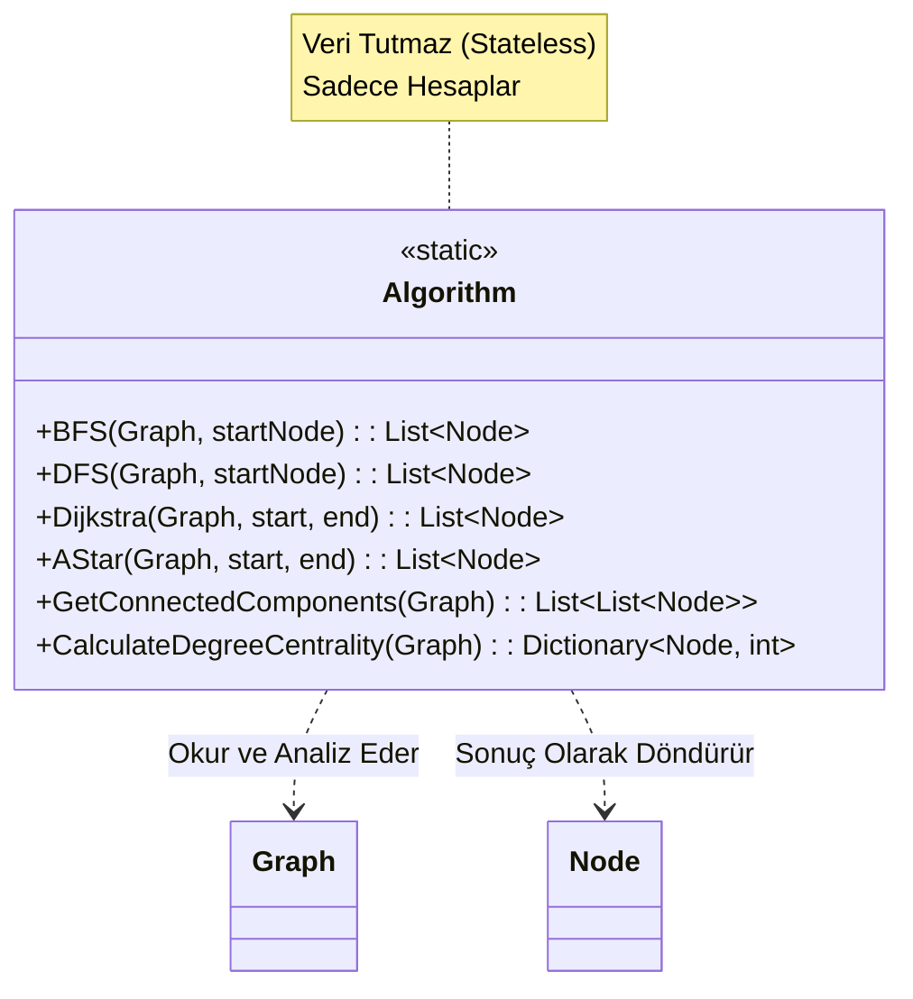
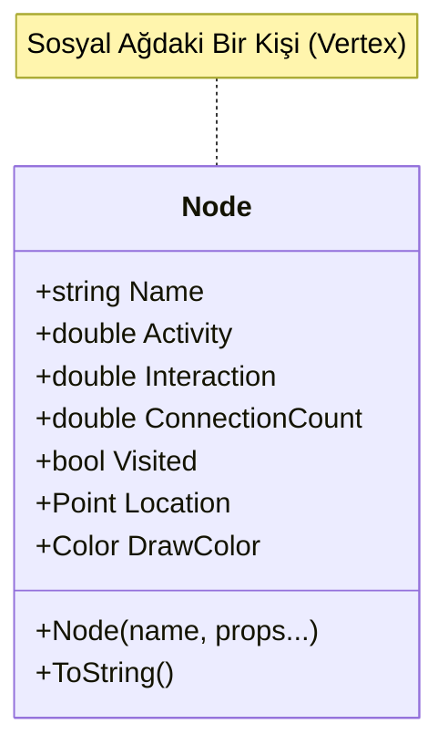
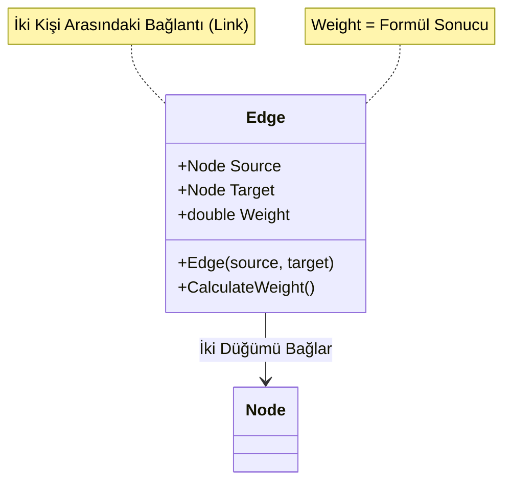
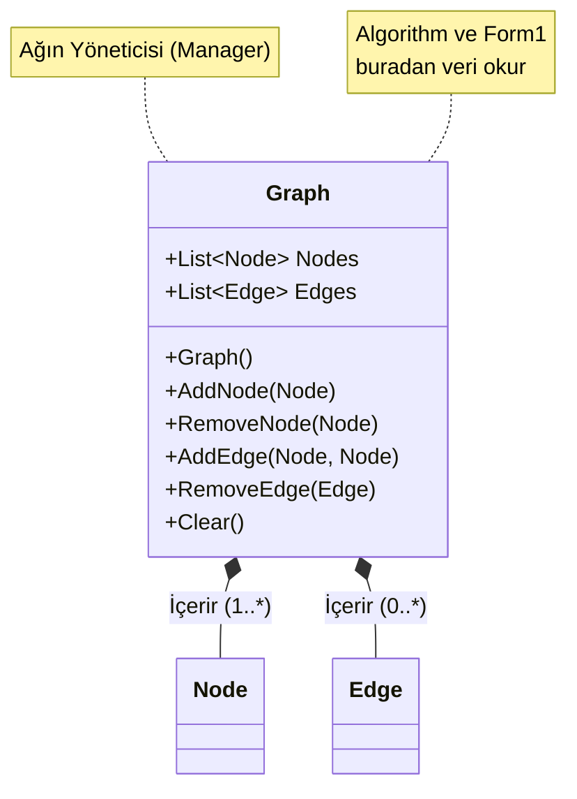
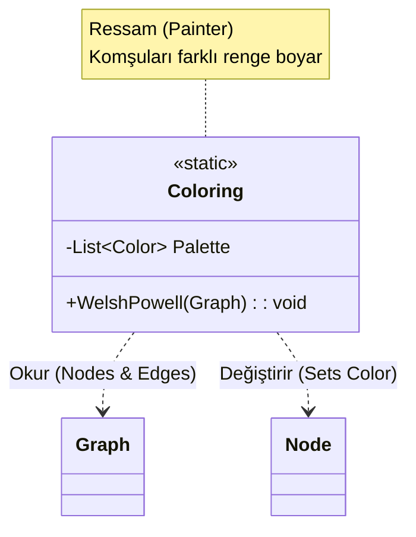
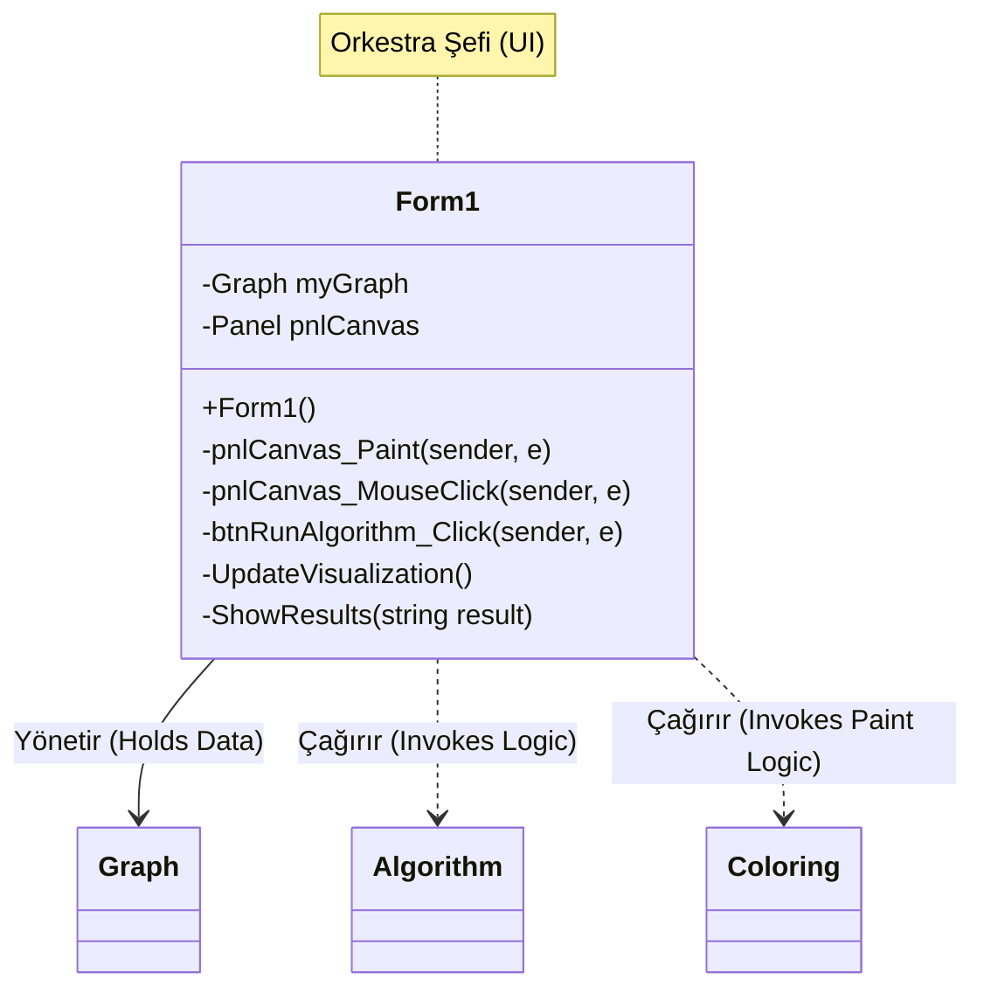

# 1. Proje Hakkinda Temel Bilgiler
## 1.1 graphSNA Nedir?
**graphSNA**, Kocaeli Üniversitesi Bilişim Sistemleri Mühendisliği Bölümü, **Yazılım Geliştirme Laboratuvarı-I** dersi kapsamında geliştirilmiş bir masaüstü uygulamasıdır. Bu proje, karmaşık sosyal ağ yapılarını matematiksel bir **Graf (Graph)** modeli olarak ele alır; kullanıcıları ve aralarındaki etkileşimleri görselleştirerek üzerinde gelişmiş analiz algoritmalarının çalıştırılmasını sağlar. Kısaca bu bir "Sosyal Ağ Analizi ve Görselleştirme Aracı" (Social Network Analysis and Visualization Tool) olarak adlandırılabilir.

## 1.2 Ekip Uyeleri
- Mehmet Burak Dorman - Öğrenci No: 251307120 - Geliştirici
- Huseyin Erekmen - Öğrenci No: 251307099 - Geliştirici

## 1.3 Tarihler
- Proje Başlangıç Tarihi: 25 Kasım 2025
- Proje Tamamlanış Tarihi: ?
---
# 2. Tanım ve Amaç
## 2.1 Problemin Tanımı
Günümüz dijital dünyasında bireyler ve topluluklar arasındaki ilişkiler (sosyal ağlar) giderek karmaşıklaşmaktadır. Milyonlarca bağlantının olduğu bir yapıda;
* İki kişi arasındaki en kısa iletişim yolunu bulmak,
* Ağdaki en etkili kişiyi tespit etmek,
* Birbirinden kopuk toplulukları ayrıştırmak,
gibi problemler çıplak gözle veya basit listelerle çözülemez hale gelmiştir. Bu verilerin anlamlandırılabilmesi için düğüm (node) ve kenar (edge) tabanlı görselleştirme tekniklerine ve algoritmik analizlere ihtiyaç duyulmaktadır.

## 2.2 Projenin Amacı
Bir görsel programlama dili olan C# kullanarak ve NYP (OOP) prensiplerine bağlı kalarak tasarlanan bu program ile amaç, kullanıcıların dinamik olarak yönetilebildiği ve analiz edilebildiği interaktif bir sistem tasarlamaktır.

Uygulama, kullanıcı özelliklerine (aktiflik, etkileşim sayısı, bağlantı sayısı) dayalı **dinamik ağırlık hesaplaması** yaparak standart graflardan farklılaşır. Aşağıdaki temel yetenekleri sunmayı hedefler:
* **Görselleştirme:** Kullanıcıların ve bağlantıların bir tuval (canvas) üzerinde çizilmesi.
* **Yol Analizi:** Dijkstra ve A* algoritmaları ile en maliyetsiz rotaların bulunması.
* **Topluluk Analizi:** Merkezilik (Centrality) hesapları ve BFS/DFS ile ağın taranması.
* **Gruplama:** Welsh-Powell algoritması ile ayrık toplulukların renklendirilerek görselleştirilmesi.
* **Veri Depolama:** Ağ yapısının JSON/CSV formatında saklanması ve taşınabilmesi.
---
## 3. Algoritmalar
### 3.1.1 Algorithm.cs 
Algorithm.cs Sınıfının Sorumlulukları:

- Hesaplama Motoru: Projenin tüm matematiksel işlemlerini yapan sınıftır.
- Yol Bulma: İki kişi arasındaki en kısa/maliyetli yolu Dijkstra ve A* algoritmalarıyla hesaplar.
- Ağ Taraması: Bir kişiden ulaşılabilecek herkesi BFS veya DFS ile bulur.
- Analiz: Ağdaki kopuk grupları (bağlı bileşenler) ve en popüler kişileri (merkezilik) tespit eder.
- Salt Okunur: Graf yapısını bozmaz, sadece analiz edip sonuç raporlar.


---
# 4. Sınıflar ve Modüller
## 4.1 Node.cs 
Node.cs Sınıfının Sorumlulukları:
- Veri Modeli: Sosyal ağdaki her bir kullanıcıyı temsil eder.
- Analiz Verileri: Ağırlık (Weight) formülü için gerekli parametreleri (Activity, Interaction, ConnectionCount) saklar.
- Görselleştirme: Düğümün tuval üzerindeki Location (X, Y) bilgisini ve Color (Renk) bilgisini tutar.
- Algoritmik Durum: Graf tarama algoritmaları için Visited (Ziyaret Edildi) durumunu yönetir.
- Etkileşim: Tıklama olaylarında arayüze detaylı kullanıcı bilgisini sağlar.


---
## 4.2 Edge.cs 
Edge.cs Sınıfının Sorumlulukları:

- Bağlantı Yönetimi: İki kullanıcı (Node) arasındaki ilişkiyi tutar.
- Maliyet Hesabı: İki kullanıcı arasındaki "benzerlik/uzaklık" skorunu, özel matematiksel formülle hesaplar.
- Algoritma Girdisi: En kısa yol algoritmalarına (Dijkstra) yolun "maliyetini" sunar.
- Görselleştirme: Arayüzde iki daire arasına çizilecek çizginin referans noktalarını sağlar.


---
## 4.3 Graph.cs 
Graph.cs Sınıfının Sorumlulukları:

- Veri Deposu: Tüm Node (Kullanıcı) ve Edge (Bağlantı) nesnelerini listelerde tutar.
- Ağ Yönetimi: Ağa yeni kişi ekleme (AddNode) veya bağlantı kurma (AddEdge) komutlarını işler.
- Veri Doğrulama: Hatalı verileri (örn: zaten var olan bir kişiyi eklemeye çalışmak) engeller.
- Servis Sağlayıcı: Form1 (Görselleştirme) ve Algorithm (Analiz) sınıflarına ihtiyaç duydukları ham veriyi sağlar.
- Kayıt Merkezi: Ağı dosyaya kaydetme veya dosyadan yükleme işlemlerini yönetir.


---
## 4.4 Coloring.cs 
Coloring.cs Sınıfının Sorumlulukları:

- Görsel Ayrıştırma: Komşu düğümleri farklı renklere boyayarak grafın okunmasını kolaylaştırır.
- Welsh-Powell Algoritması: Düğümleri renklendirmek için proje isterlerinde zorunlu tutulan özel algoritmayı çalıştırır.
- Derece Analizi: Algoritma gereği önce en çok bağlantısı olan (en popüler) düğümleri boyamaya başlar.
- Renk Yönetimi: Sistemde kullanılabilecek renk paletini (Örn: Kırmızı, Mavi, Yeşil, Sarı...) yönetir ve atar.
- Durum Değiştirici: Node sınıfının Color özelliğini doğrudan günceller.


---
## 4.5 Form1.cs 
Form1.cs Sınıfının Sorumlulukları:

- Görselleştirme Motoru: Graph içindeki düğüm ve kenarları Paint olayını kullanarak ekrana çizer (Render).
- Etkileşim Yöneticisi: Fare tıklamalarıyla (MouseClick) düğüm seçme, sürükleme veya bilgi görüntüleme işlemlerini yönetir.
- Komuta Merkezi: Kullanıcının "Analiz Yap", "Kaydet", "Yükle" gibi komutlarını alır ve ilgili sınıflara iletir.
- Köprü (Bridge): Arka plandaki mantık (Algorithm.cs) ile kullanıcının gördüğü ekran arasındaki bağlantıyı kurar.
- Güncelleme: Veri değiştiğinde (yeni düğüm eklendiğinde) ekranı Invalidate() komutuyla yeniden boyatır.


    UI-->>User: Sonucu Ekranda Göster
```
---
