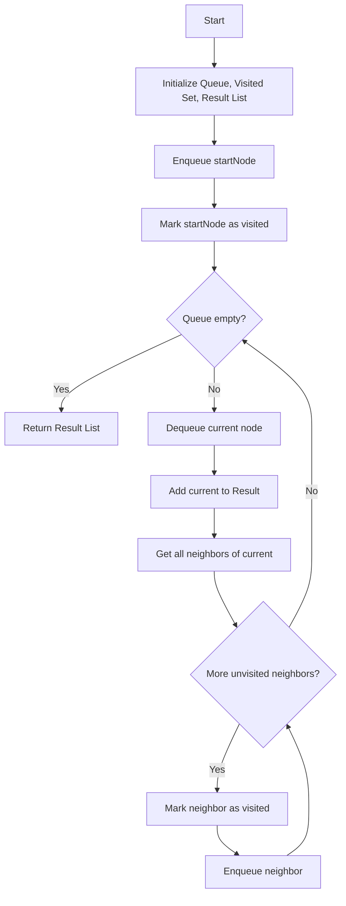
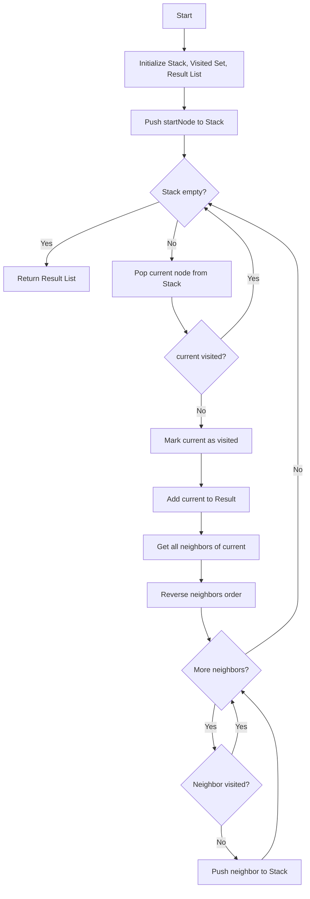
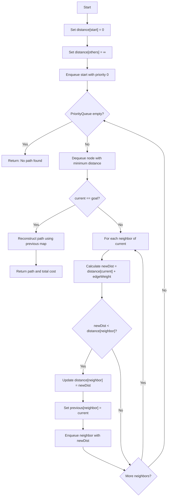
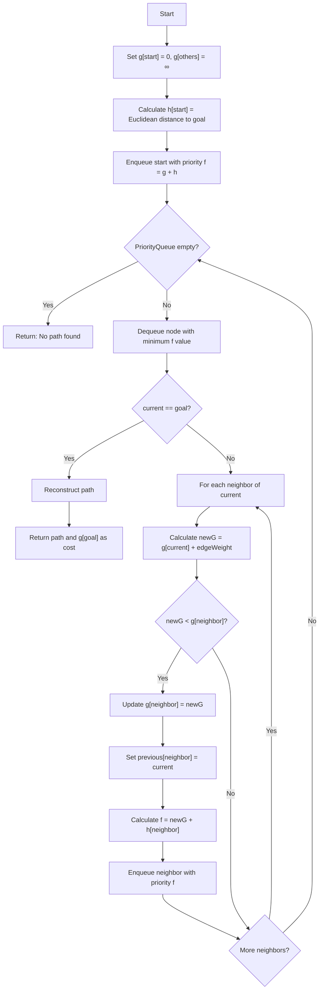
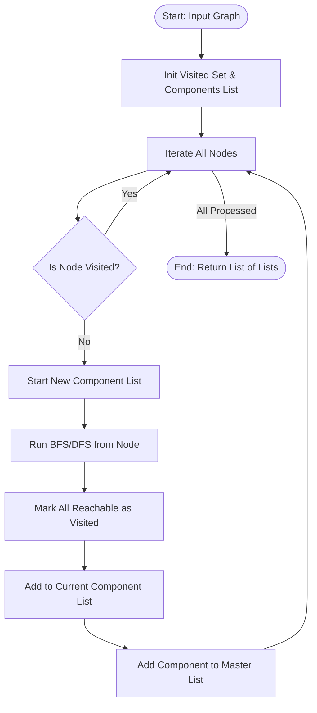
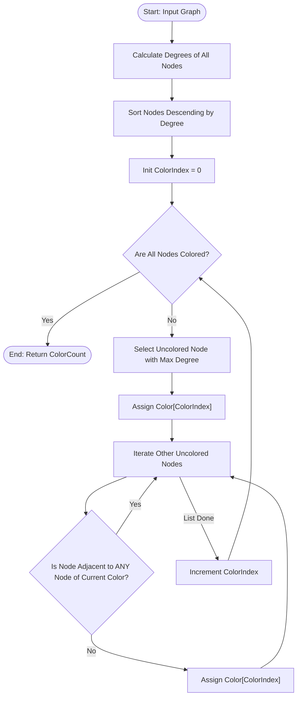
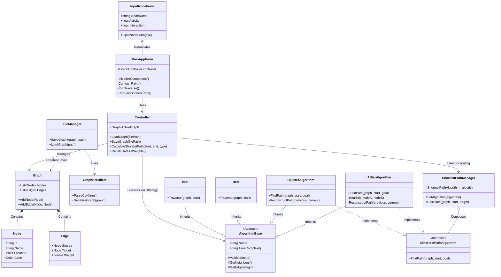

# 1. Proje Hakkinda Temel Bilgiler
## 1.1 graphSNA Nedir?
**graphSNA**, Kocaeli Üniversitesi Bilişim Sistemleri Mühendisliği Bölümü, **Yazılım Geliştirme Laboratuvarı-I** dersi kapsamında geliştirilmiş bir masaüstü uygulamasıdır. Bu proje, karmaşık sosyal ağ yapılarını matematiksel bir **Graf (Graph)** modeli olarak ele alır; kullanıcıları ve aralarındaki etkileşimleri görselleştirerek üzerinde gelişmiş analiz algoritmalarının çalıştırılmasını sağlar. Kısaca bu bir "Sosyal Ağ Analizi ve Görselleştirme Aracı" (Social Network Analysis and Visualization Tool) olarak adlandırılabilir.

## 1.2 Ekip Uyeleri
- Mehmet Burak Dorman - Öğrenci No: 251307120 - Geliştirici
- Hüseyin Erekmen - Öğrenci No: 251307099 - Geliştirici

## 1.3 Tarihler
- Proje Başlangıç Tarihi: 25 Kasım 2025
- Proje Tamamlanış Tarihi: ?
---
# 2. Tanım ve Amaç
## 2.1 Problemin Tanımı
Günümüz dijital dünyasında bireyler ve topluluklar arasındaki ilişkiler (sosyal ağlar) giderek karmaşıklaşmaktadır. Milyonlarca bağlantının olduğu bir yapıda;
* İki kişi arasındaki en kısa iletişim yolunu bulmak,
* Ağdaki en etkili kişiyi tespit etmek,
* Birbirinden kopuk toplulukları ayrıştırmak,
gibi problemler çıplak gözle veya basit listelerle çözülemez hale gelmiştir. Bu verilerin anlamlandırılabilmesi için düğüm (node) ve kenar (edge) tabanlı görselleştirme tekniklerine ve algoritmik analizlere ihtiyaç duyulmaktadır.

## 2.2 Projenin Amacı
Bir görsel programlama dili olan C# kullanarak ve NYP (OOP) prensiplerine bağlı kalarak tasarlanan bu program ile amaç, kullanıcıların dinamik olarak yönetilebildiği ve analiz edilebildiği interaktif bir sistem tasarlamaktır.

Uygulama, kullanıcı özelliklerine (aktiflik, etkileşim sayısı, bağlantı sayısı) dayalı **dinamik ağırlık hesaplaması** yaparak standart graflardan farklılaşır. Aşağıdaki temel yetenekleri sunmayı hedefler:
* **Görselleştirme:** Kullanıcıların ve bağlantıların bir tuval (canvas) üzerinde çizilmesi.
* **Yol Analizi:** Dijkstra ve A* algoritmaları ile en maliyetsiz rotaların bulunması.
* **Topluluk Analizi:** Merkezilik (Centrality) hesapları ve BFS/DFS ile ağın taranması.
* **Gruplama:** Welsh-Powell algoritması ile ayrık toplulukların renklendirilerek görselleştirilmesi.
* **Veri Depolama:** Ağ yapısının JSON/CSV formatında saklanması ve taşınabilmesi.
---
## 3. Algoritmalar
### 3.1.1 Breadth-First Search (BFS)
Çalışma Mantığı: FS, bir graf üzerinde seviye seviye ilerleyen bir arama algoritmasıdır. Başlangıç düğümünden başlayarak önce tüm komşuları ziyaret eder, ardından komşuların komşularına geçer. FIFO (First In First Out) prensibiyle çalışan Queue (Kuyruk) veri yapısı kullanır.
Adımlar:
1.	Başlangıç düğümünü kuyruğa ekle ve ziyaret edildi olarak işaretle
2.	Kuyruktan bir düğüm çıkar, sonuç listesine ekle
3.	Bu düğümün ziyaret edilmemiş tüm komşularını kuyruğa ekle
4.	Kuyruk boşalana kadar 2-3 adımlarını tekrarla

### 3.1.2 Karmaşıklık Analizi
| Metrik             | Değer    | Açıklama                                                                   |
|--------------------|----------|----------------------------------------------------------------------------|
| Zaman Karmaşıklığı | O(V + E) | Her düğüm (V) bir kez ziyaret edilir, her kenar (E) bir kez kontrol edilir |
| Alan Karmaşıklığı  | O(V)     | Queue ve Visited set en fazla V eleman tutar                               |

### 3.1.3 Literatür İncelemesi
- İlk Tanım: Edward F. Moore (1959) - Labirent çözümü için geliştirildi
- Kullanım Alanları:
- - Sosyal ağlarda "arkadaş önerisi" (2 derece uzaklıktaki kişiler)
- - GPS navigasyonunda en az aktarmalı rota bulma
- - Web crawler'larda sayfa indeksleme
- - Ağ yayılımı (broadcast) protokolleri
- Kaynak: Cormen, T. H., et al. "Introduction to Algorithms" (2009), Chapter 22.2

---
### 3.2.1 DFS (Depth-First Search) - Derinlik Öncelikli Arama
Çalışma Mantığı: DFS, bir dalı sonuna kadar takip eden ve ardından geri dönerek diğer dalları keşfeden bir arama algoritmasıdır. LIFO (Last In First Out) prensibiyle çalışan Stack (Yığın) veri yapısı kullanır. Bir yolda gidebildiği kadar derine iner, çıkmaza girince geri döner (backtracking).
Adımlar:
1.	Başlangıç düğümünü stack'e ekle
2.	Stack'ten bir düğüm çıkar (pop)
3.	Ziyaret edilmediyse: ziyaret edildi olarak işaretle, sonuç listesine ekle
4.	Tüm komşularını stack'e ekle
5.	Stack boşalana kadar 2-4 adımlarını tekrarla

### 3.2.2 Karmaşıklık Analizi
| Metrik             | Değer    | Açıklama                                                                   |
|--------------------|----------|----------------------------------------------------------------------------|
| Zaman Karmaşıklığı | O(V + E) | Her düğüm ve kenar bir kez işlenir |
| Alan Karmaşıklığı  | O(V)     | Stack derinliği en kötü durumda V olabilir                               |

### 3.2.3 Literatür İncelemesi
- İlk Tanım: Charles Pierre Trémaux (19. yüzyıl) - Labirent çözümü
- Kullanım Alanları:
- - Topolojik sıralama (görev bağımlılıkları)
- - Döngü tespiti (cycle detection)
- - Bağlı bileşen analizi
- - Puzzle çözümü (Sudoku, satranç)
- - Derleyicilerde syntax tree traversal
- Kaynak: Tarjan, R. E. "Depth-First Search and Linear Graph Algorithms" (1972), SIAM Journal on Computing

---
### 3.3.1 Dijkstra Algoritması
Çalışma Mantığı: Dijkstra, ağırlıklı graflarda tek bir kaynaktan diğer tüm düğümlere en kısa yolu bulan bir algoritmadır. Greedy (Açgözlü) yaklaşım kullanır: her adımda en düşük maliyetli düğümü seçer. Priority Queue (Öncelik Kuyruğu) veri yapısı ile optimize edilir.
Adımlar:
1.	Başlangıç düğümünün mesafesini 0, diğerlerini ∞ olarak ayarla
2.	Priority Queue'dan en küçük mesafeli düğümü çıkar
3.	Bu düğümün her komşusu için: yeni mesafe daha kısaysa güncelle
4.	Hedef düğüme ulaşana veya kuyruk boşalana kadar tekrarla
5.	Yolu geriye doğru takip ederek reconstruct et

### 3.3.2 Karmaşıklık Analizi
| Metrik             | Değer    | Açıklama                                                                   |
|--------------------|----------|----------------------------------------------------------------------------|
| Zaman Karmaşıklığı | O((V + E) log V) | Priority Queue ile; her düğüm/kenar için log V'lik işlem |
| Alan Karmaşıklığı  | O(V)     | Distance ve Previous dictionary'leri                               |

### 3.3.3 Literatür İncelemesi
- İlk Tanım: Edsger W. Dijkstra (1956) - "A note on two problems in connexion with graphs"
- Kısıtlama: Negatif ağırlıklı kenarlarda çalışmaz (Bellman-Ford gerekir)
- Kullanım Alanları:
- - Google Maps, Yandex Navigasyon rota hesaplama
- - Network routing protokolleri (OSPF, IS-IS)
- - Telekomünikasyonda çağrı yönlendirme
- - Oyunlarda NPC pathfinding
- Kaynak: Dijkstra, E. W. "A note on two problems in connexion with graphs" (1959), Numerische Mathematik

---
### 3.4.1 A* (A-Star) Algoritması
Çalışma Mantığı: A*, Dijkstra'nın geliştirilmiş halidir. Heuristic (Sezgisel) fonksiyon kullanarak hedefe yönelik arama yapar. 
Değerlendirme fonksiyonu: f(n) = g(n) + h(n)
- g(n): Başlangıçtan n'e olan gerçek maliyet
- h(n): n'den hedefe tahmini maliyet (heuristic)
Projede Euclidean Distance (Öklid Mesafesi) heuristic olarak kullanılmıştır.
Adımlar:
1.	Dijkstra ile aynı başlangıç
2.	Priority Queue'ya eklerken: f = g + h değerini kullan
3.	Hedefe yakın düğümler öncelikli işlenir
4.	Optimal yol garantisi (admissible heuristic ile)

### 3.4.2 Karmaşıklık Analizi
| Metrik             | Değer    | Açıklama                                                                   |
|--------------------|----------|----------------------------------------------------------------------------|
| Zaman Karmaşıklığı | O((V + E) log V) | En kötü durumda Dijkstra ile aynı |
| Alan Karmaşıklığı  | O(V)     | Distance, Previous ve Priority Queue Pratikte Dijkstra'dan hızlı Heuristic sayesinde daha az düğüm ziyaret edilir |

### 3.4.3 Literatür İncelemesi
- İlk Tanım: Peter Hart, Nils Nilsson, Bertram Raphael (1968) - Stanford Research Institute
- Makale: "A Formal Basis for the Heuristic Determination of Minimum Cost Paths"
- Heuristic Türleri:
- - Euclidean Distance: √((x₁-x₂)² + (y₁-y₂)²)
- - Manhattan Distance: |x₁-x₂| + |y₁-y₂|
- - Chebyshev Distance: max(|x₁-x₂|, |y₁-y₂|)
- Kullanım Alanları:
- - Video oyunlarında pathfinding (Unity, Unreal Engine)
- - Robotik navigasyon
- - Harita uygulamalarında gerçek zamanlı rota
- Kaynak: Hart, P. E., et al. "A Formal Basis for the Heuristic Determination of Minimum Cost Paths" (1968), IEEE Transactions on Systems Science and Cybernetics

---
### 3.5.1 Connected Components
Çalışma Mantığı: Bu algoritma, izole edilmiş alt grafikleri tanımlar. Her düğümü tek tek inceler; eğer bir düğüm ziyaret edilmemişse, oradan ulaşılabilir tüm düğümleri bulmak için bir geçiş (BFS/DFS) başlatır ve bunları tek bir "bileşen" halinde gruplandırır.

### 3.5.2 Karmaşıklık Analizi
| Metrik             | Değer    | Açıklama                                                                   |
|--------------------|----------|----------------------------------------------------------------------------|
| Zaman Karmaşıklığı | O(V + E) | Çünkü her düğümü ve kenarı tam olarak bir kez ziyaret eder. |

### 3.5.3 Literatür İncelemesi
- Ağ analizinin temel unsurlarından biri, ağın dayanıklılığını belirlemektir. Bir ağın 1 bileşeni varsa, tamamen bağlıdır. Birden fazla bileşeni varsa, parçalanmıştır.

---
### 3.6.1 Graph Coloring (Welsh-Powell)
Çalışma Mantığı: Bir grafı, bitişik iki düğümün aynı renge sahip olmaması koşuluyla renklendirmek için kullanılan bir algoritma. Düğümleri bağlantı sayısına (dereceye) göre azalan sırada sıralar. İlk rengi en yüksek dereceli düğüme ve ardından bitişik olmayan tüm düğümlere atar, sonra bir sonraki renge geçer.

### 3.6.2 Karmaşıklık Analizi
| Metrik             | Değer    | Açıklama                                                                   |
|--------------------|----------|----------------------------------------------------------------------------|
| Zaman Karmaşıklığı | O(V^2 + E) | Sıralama ve komşuluk kontrolü nedeniyle |

### 3.6.3 Literatür İncelemesi
- 1967'de D. J. A. Welsh ve M. B. Powell tarafından önerilmiştir. Bir grafın kromatik sayısı için upper bound sağlar ve zamanlama problemlerinde (örneğin, sınav zamanlaması) ve derleyicilerde register tahsisinde kullanılır.

---
### 3.7.1 Algoritma Karşılaştırma Tablosu
| Algoritma | Zaman        | Alan | Ağırlıklı Graf | Optimal Yol    | Kullanım Senaryosu                  |
|-----------|--------------|------|----------------|----------------|-------------------------------------|
| BFS       | O(V+E)       | O(V) | ❌              | ✅ (ağırlıksız) | Seviye bazlı keşif, arkadaş önerisi |
| DFS       | O(V+E)       | O(V) | ❌              | ❌              | Döngü tespiti, topolojik sıralama   |
| Dijkstra  | O((V+E)logV) | O(V) | ✅              | ✅              | Ağırlıklı en kısa yol               |
| A*        | O((V+E)logV) | O(V) | ✅              | ✅              | Koordinat bilgisi varsa hızlı yol   |

### 3.7.2 Kaynakça 
1.	Cormen, T. H., Leiserson, C. E., Rivest, R. L., & Stein, C. (2009). Introduction to Algorithms (3rd ed.). MIT Press.
2.	Dijkstra, E. W. (1959). A note on two problems in connexion with graphs. Numerische Mathematik, 1(1), 269-271.
3.	Hart, P. E., Nilsson, N. J., & Raphael, B. (1968). A formal basis for the heuristic determination of minimum cost paths. IEEE Transactions on Systems Science and Cybernetics, 4(2), 100-107.
4.	Tarjan, R. E. (1972). Depth-first search and linear graph algorithms. SIAM Journal on Computing, 1(2), 146-160.
5.	Moore, E. F. (1959). The shortest path through a maze. Proceedings of the International Symposium on the Theory of Switching, 285-292.

---
## 4. Sınıflar 

---
