<div align="center">
  
  <h1>graphSNA</h1>
  <p>Social Network Analysis & Graph Algorithm Visualization — built with C# Windows Forms</p>
</div>

---

## Table of Contents

- [Overview](#overview)
- [Screenshots](#screenshots)
- [Features](#features)
- [Getting Started](#getting-started)
- [Algorithms](#algorithms)
- [Architecture](#architecture)
- [Test Results](#test-results)
- [Performance](#performance)
- [Limitations](#limitations)
- [Roadmap](#roadmap)
- [Authors](#authors)

---

## Overview

graphSNA models social networks as weighted, undirected graphs and provides an interactive canvas alongside a full suite of graph algorithms to analyze them. Nodes represent users with `Activity` and `Interaction` properties; edge weights are derived dynamically from these values. Datasets can be imported via CSV, and the graph renders automatically using a force-directed layout.

**Tech stack:** C# · .NET Framework · Windows Forms · GDI+

---

## Screenshots

### Graph Visualization

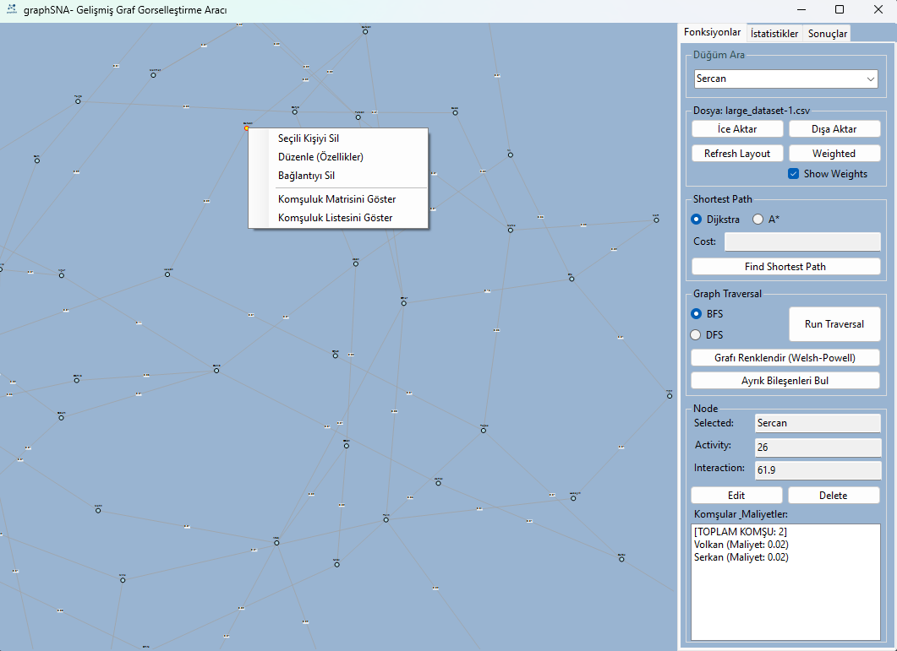

### Shortest Path (Dijkstra)

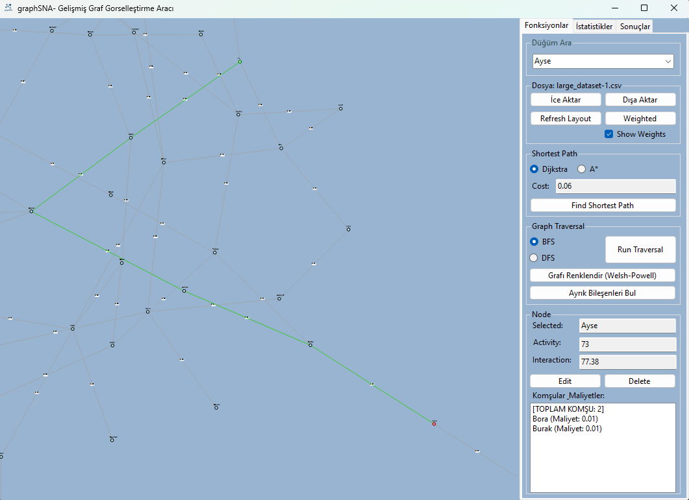

### Node Details & Neighbor Costs

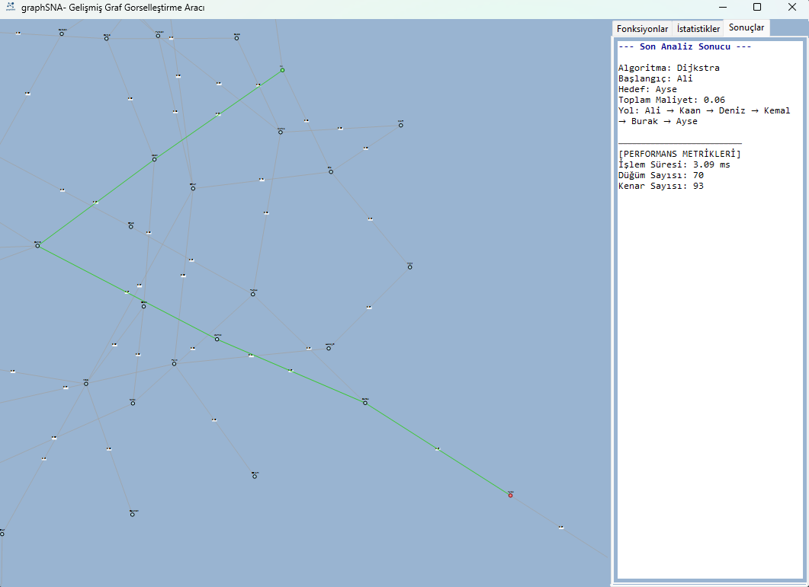

### Graph Coloring (Welsh-Powell)

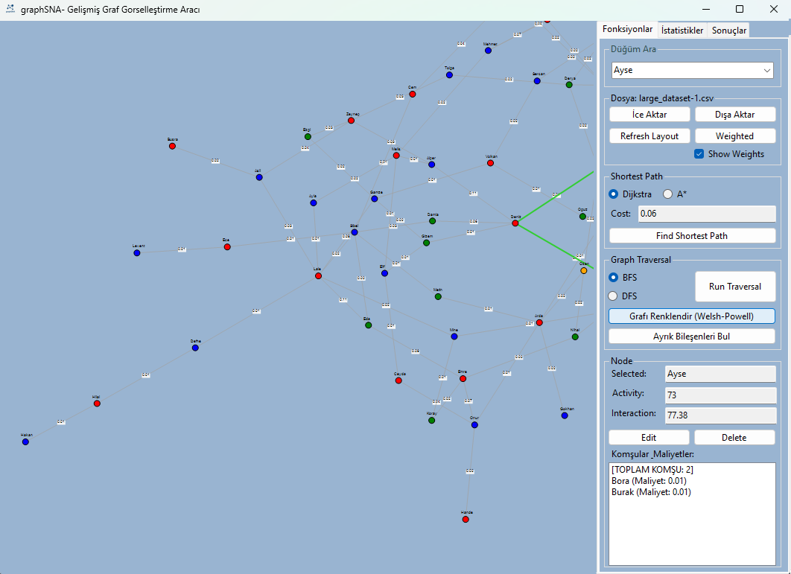

---

## Features

- **Interactive Graph Canvas** — Zoom, pan, and drag nodes on a GDI+-rendered canvas with force-directed auto-layout
- **Graph Traversal** — BFS and DFS with step-by-step animation
- **Shortest Path** — Dijkstra and A\* (Euclidean heuristic), with the result path highlighted on the canvas
- **Graph Coloring** — Welsh-Powell algorithm; reports the chromatic number
- **Connected Components** — Detects isolated subgraphs within the network
- **Centrality Analysis** — Ranks the top 5 most influential nodes by degree centrality score
- **Dynamic Edge Weights** — Computed from node `Activity` and `Interaction` scores
- **CSV Import / Export** — Load and save graph datasets; UTF-8 BOM support for broad tool compatibility
- **Node Management** — Add, edit, and delete nodes from the UI or via right-click context menu; input validation enforced throughout

---

## Getting Started

### Prerequisites

- Windows OS
- .NET Framework 4.7.2 or later
- Visual Studio 2022 or later

### Running

```bash
git clone https://github.com/DevBD1/graphSNA.git
```

Open `graphSNA.sln` in Visual Studio, build, and run.

### CSV Format

Columns: `ID`, `Name`, `Activity` (0–100), `Interaction` (0–100), `Neighbors` (comma-separated IDs)

```
ID,Name,Activity,Interaction,Neighbors
1,Alice,75,80,"2,3"
2,Bob,60,90,"1,3"
3,Carol,88,45,"1,2"
```

Sample datasets are included in `src/Assets/`.

---

## Algorithms

### BFS — Breadth-First Search

Explores nodes level by level using a FIFO queue. Used for reachability analysis and traversal order simulation.

| Complexity | Value |
|---|---|
| Time | O(V + E) |
| Space | O(V) |

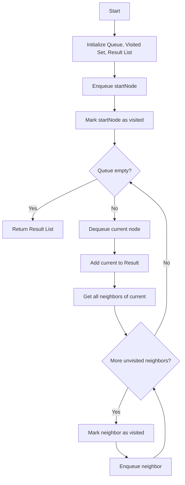
```mermaid
flowchart TD
    A["Start"] --> B["Initialize Queue, Visited Set, Result List"]
    B --> C["Enqueue startNode"]
    C --> D["Mark startNode as visited"]
    D --> E{"Queue empty?"}
    E -->|Yes| F["Return Result List"]
    E -->|No| G["Dequeue current node"]
    G --> H["Add current to Result"]
    H --> I["Get all neighbors of current"]
    I --> J{"More unvisited neighbors?"}
    J -->|Yes| K["Mark neighbor as visited"]
    K --> L["Enqueue neighbor"]
    L --> J
    J -->|No| E
```

---

### DFS — Depth-First Search

Follows one path as deep as possible before backtracking, using a LIFO stack.

| Complexity | Value |
|---|---|
| Time | O(V + E) |
| Space | O(V) |

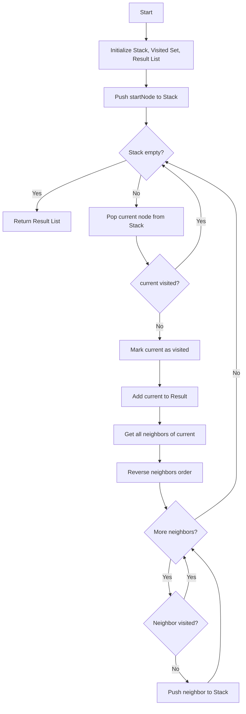
```mermaid
flowchart TD
    A["Start"] --> B["Initialize Stack, Visited Set, Result List"]
    B --> C["Push startNode to Stack"]
    C --> D{"Stack empty?"}
    D -->|Yes| E["Return Result List"]
    D -->|No| F["Pop current node from Stack"]
    F --> G{"current visited?"}
    G -->|Yes| D
    G -->|No| H["Mark current as visited"]
    H --> I["Add current to Result"]
    I --> J["Get all neighbors of current"]
    J --> K["Reverse neighbors order"]
    K --> L{"More neighbors?"}
    L -->|Yes| M{"Neighbor visited?"}
    M -->|Yes| L
    M -->|No| N["Push neighbor to Stack"]
    N --> L
    L -->|No| D
```

---

### Dijkstra

Single-source shortest path for weighted graphs using a greedy approach and a priority queue.

| Complexity | Value |
|---|---|
| Time | O((V + E) log V) |
| Space | O(V) |

> Does not support negative edge weights.

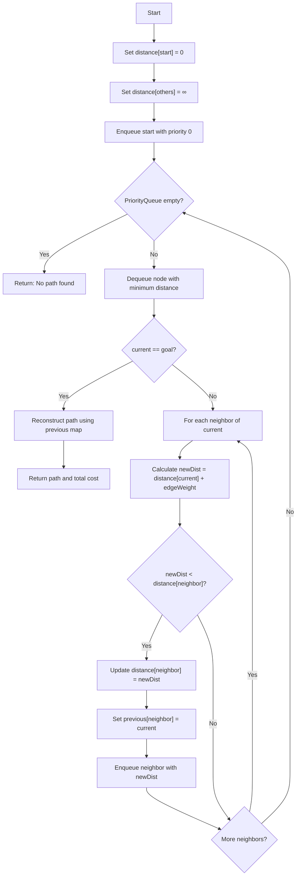
```mermaid
flowchart TD
    A["Start"] --> B["Set distance[start] = 0"]
    B --> C["Set distance[others] = ∞"]
    C --> D["Enqueue start with priority 0"]
    D --> E{"PriorityQueue empty?"}
    E -->|Yes| F["Return: No path found"]
    E -->|No| G["Dequeue node with minimum distance"]
    G --> H{"current == goal?"}
    H -->|Yes| I["Reconstruct path using previous map"]
    I --> J["Return path and total cost"]
    H -->|No| K["For each neighbor of current"]
    K --> L["Calculate newDist = distance[current] + edgeWeight"]
    L --> M{"newDist < distance[neighbor]?"}
    M -->|Yes| N["Update distance[neighbor] = newDist"]
    N --> O["Set previous[neighbor] = current"]
    O --> P["Enqueue neighbor with newDist"]
    P --> Q{"More neighbors?"}
    M -->|No| Q
    Q -->|Yes| K
    Q -->|No| E
```

---

### A\* (A-Star)

Extends Dijkstra with a heuristic function `f(n) = g(n) + h(n)` to guide the search toward the goal. This implementation uses Euclidean distance as the heuristic, resulting in fewer node visits than Dijkstra in practice.

| Complexity | Value |
|---|---|
| Time | O((V + E) log V) |
| Space | O(V) |

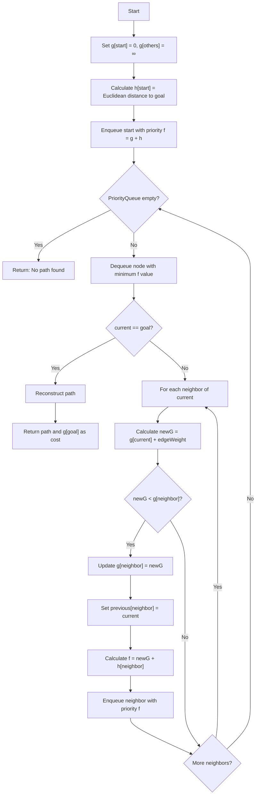
```mermaid
flowchart TD
    A["Start"] --> B["Set g[start] = 0, g[others] = ∞"]
    B --> C["Calculate h[start] = Euclidean distance to goal"]
    C --> D["Enqueue start with priority f = g + h"]
    D --> E{"PriorityQueue empty?"}
    E -->|Yes| F["Return: No path found"]
    E -->|No| G["Dequeue node with minimum f value"]
    G --> H{"current == goal?"}
    H -->|Yes| I["Reconstruct path"]
    I --> J["Return path and g[goal] as cost"]
    H -->|No| K["For each neighbor of current"]
    K --> L["Calculate newG = g[current] + edgeWeight"]
    L --> M{"newG < g[neighbor]?"}
    M -->|Yes| N["Update g[neighbor] = newG"]
    N --> O["Set previous[neighbor] = current"]
    O --> P["Calculate f = newG + h[neighbor]"]
    P --> Q["Enqueue neighbor with priority f"]
    Q --> R{"More neighbors?"}
    M -->|No| R
    R -->|Yes| K
    R -->|No| E
```

---

### Connected Components

Identifies isolated subgraphs by running BFS/DFS from every unvisited node.

| Complexity | Value |
|---|---|
| Time | O(V + E) |

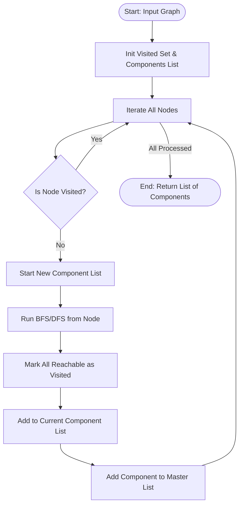
```mermaid
flowchart TD
    A([Start: Input Graph]) --> B[Init Visited Set & Components List]
    B --> C[Iterate All Nodes]
    C --> D{Is Node Visited?}
    D -- Yes --> C
    D -- No --> E[Start New Component List]
    E --> F[Run BFS/DFS from Node]
    F --> G[Mark All Reachable as Visited]
    G --> H[Add to Current Component List]
    H --> I[Add Component to Master List]
    I --> C
    C -- All Processed --> J([End: Return List of Components])
```

---

### Welsh-Powell Graph Coloring

Sorts nodes by degree descending, then greedily assigns the minimum number of colors such that no two adjacent nodes share one. Reports the chromatic number.

| Complexity | Value |
|---|---|
| Time | O(V² + E) |

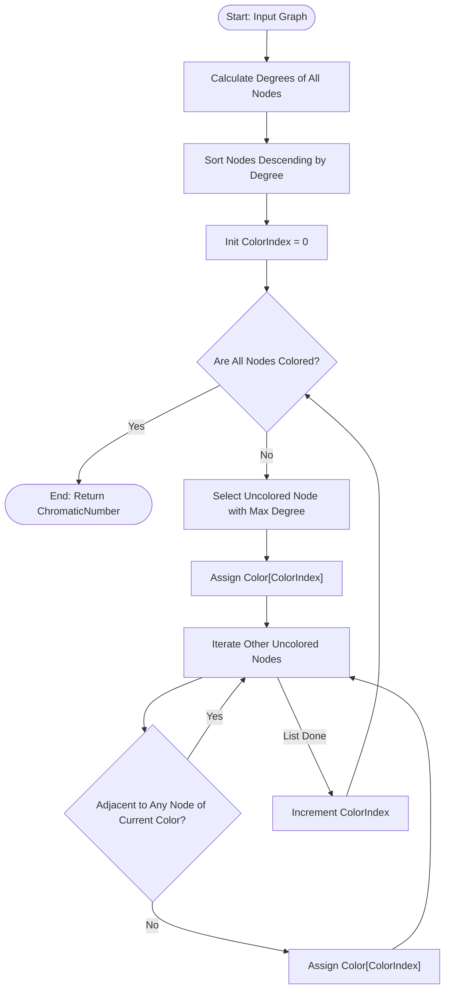
```mermaid
flowchart TD
    A([Start: Input Graph]) --> B[Calculate Degrees of All Nodes]
    B --> C[Sort Nodes Descending by Degree]
    C --> D[Init ColorIndex = 0]
    D --> E{Are All Nodes Colored?}
    E -- Yes --> F([End: Return ChromaticNumber])
    E -- No --> G[Select Uncolored Node with Max Degree]
    G --> H["Assign Color[ColorIndex]"]
    H --> I[Iterate Other Uncolored Nodes]
    I --> J{Adjacent to Any Node of Current Color?}
    J -- No --> K["Assign Color[ColorIndex]"]
    J -- Yes --> I
    K --> I
    I -- List Done --> L[Increment ColorIndex]
    L --> E
```

---

### Algorithm Comparison

| Algorithm | Time | Space | Weighted | Optimal Path | Use Case |
|---|---|---|---|---|---|
| BFS | O(V+E) | O(V) | ✗ | ✓ (unweighted) | Level-based traversal, reachability |
| DFS | O(V+E) | O(V) | ✗ | ✗ | Cycle detection, topological sort |
| Dijkstra | O((V+E) log V) | O(V) | ✓ | ✓ | Weighted shortest path |
| A\* | O((V+E) log V) | O(V) | ✓ | ✓ | Heuristic-guided shortest path |

---

## Architecture

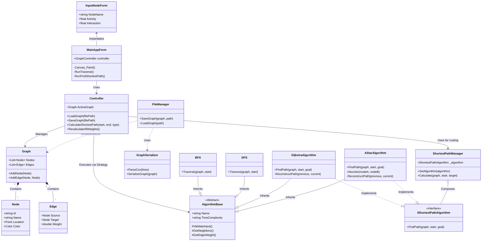
```mermaid
classDiagram
    %% UI Layer
    MainAppForm --> Controller : Uses
    InputNodeForm <-- MainAppForm : Instantiates

    %% Core
    Controller --> Graph : Manages
    Controller --> AlgorithmBase : Executes via Strategy
    Controller --> ShortestPathManager : Uses for routing

    %% Graph model
    Graph "1" *-- "*" Node : Contains
    Graph "1" *-- "*" Edge : Contains
    FileManager ..> Graph : Creates/Saves
    FileManager ..> GraphSerializer : Uses

    %% Traversal
    BFS --|> AlgorithmBase : Inherits
    DFS --|> AlgorithmBase : Inherits

    %% Shortest Path — Strategy Pattern
    DijkstraAlgorithm --|> AlgorithmBase : Inherits
    AStarAlgorithm --|> AlgorithmBase : Inherits
    DijkstraAlgorithm ..|> IShortestPathAlgorithm : Implements
    AStarAlgorithm ..|> IShortestPathAlgorithm : Implements
    ShortestPathManager o-- IShortestPathAlgorithm : Composes

    class MainAppForm {
        +GraphController controller
        -Canvas_Paint()
        -RunTraverse()
        -RunFindShortestPath()
    }
    class InputNodeForm {
        +string NodeName
        +float Activity
        +float Interaction
    }
    class Controller {
        +Graph ActiveGraph
        +LoadGraph(filePath)
        +SaveGraph(filePath)
        +CalculateShortestPath(start, end, type)
        +RecalculateAllWeights()
    }
    class Graph {
        +List~Node~ Nodes
        +List~Edge~ Edges
        +AddNode(Node)
        +AddEdge(Node, Node)
    }
    class Node {
        +string Id
        +string Name
        +Point Location
        +Color Color
    }
    class Edge {
        +Node Source
        +Node Target
        +double Weight
    }
    class FileManager {
        +SaveGraph(graph, path)
        +LoadGraph(path)
    }
    class GraphSerializer {
        +ParseCsv(lines)
        +SerializeGraph(graph)
    }
    class AlgorithmBase {
        <<Abstract>>
        +string Name
        +string TimeComplexity
        #ValidateInput()
        #GetNeighbors()
        #GetEdgeWeight()
    }
    class BFS {
        +Traverse(graph, start)
    }
    class DFS {
        +Traverse(graph, start)
    }
    class IShortestPathAlgorithm {
        <<Interface>>
        +FindPath(graph, start, goal)
    }
    class ShortestPathManager {
        -IShortestPathAlgorithm _algorithm
        +SetAlgorithm(algorithm)
        +Calculate(graph, start, target)
    }
    class DijkstraAlgorithm {
        +FindPath(graph, start, goal)
        -ReconstructPath(previous, current)
    }
    class AStarAlgorithm {
        +FindPath(graph, start, goal)
        -Heuristic(nodeA, nodeB)
        -ReconstructPath(previous, current)
    }
```

**Key design decisions:**

- **Strategy Pattern** — `IShortestPathAlgorithm` allows swapping Dijkstra and A\* at runtime via `ShortestPathManager`
- **Template Method** — `AlgorithmBase` centralizes shared logic (`GetNeighbors`, `ValidateInput`, `GetEdgeWeight`) to eliminate duplication across traversal implementations
- **Encapsulation** — `GraphController` acts as the boundary between the UI and data layers; forms never access graph data directly

---

## Test Results

### CSV Import & Visualization

**Input:** `large_dataset-1.csv` — nodes with ID, Name, normalized Activity and Interaction values (0–100)

**Result:** `GraphSerializer` parsed all nodes and adjacency relationships correctly; special characters rendered without corruption thanks to UTF-8 BOM support.

---

### Input Validation

**Steps:** Open node edit form → enter `150` or `abc` in the Activity field → click Save

**Result:** `InputNodeForm` rejected the input with `"Values must be between 0 and 100"` / `"Enter a valid numeric value"`. No data was written.

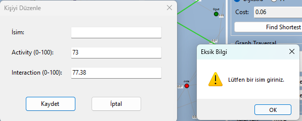

---

### Shortest Path Accuracy

**Steps:** Select start and goal nodes → run Dijkstra

**Result:** `DijkstraAlgorithm` found the minimum-cost route using a priority queue; total cost displayed in the UI and the path drawn in red on the canvas.


---

### Graph Coloring (Welsh-Powell)

**Steps:** Click the Coloring button

**Result:** Algorithm sorted nodes by degree, assigned colors greedily — no two adjacent nodes share a color. Chromatic number reported in the UI.


---

### Centrality Analysis

**Steps:** Click Refresh Stats

**Result:** `Controller.GetTopInfluencers` ranked nodes by `ConnectionCount × Interaction`; the DataGridView listed the top-scoring nodes correctly.

---

## Performance

**Small dataset (~20 nodes)**


**Large dataset (~100 nodes)**


---

## Limitations

| Limitation | Detail |
|---|---|
| CSV only | No JSON import/export |
| Undirected graphs only | Directed edges not supported |
| No negative weights | Dijkstra limitation; Bellman-Ford not implemented |
| No multi-edges | Only one edge per node pair |
| No undo/redo | Command pattern not implemented |
| No auto-save prompt | Unsaved changes can be lost on close |

---

## Roadmap

- Bellman-Ford for negative-weight graphs
- PageRank centrality
- Community detection (Louvain / Girvan-Newman)
- Minimum Spanning Tree (Kruskal / Prim)
- Async force-directed layout (background thread)
- Undo/Redo via Command pattern
- Dark mode / theme support

---

## References

1. Cormen, T. H., Leiserson, C. E., Rivest, R. L., & Stein, C. (2009). *Introduction to Algorithms* (3rd ed.). MIT Press.
2. Dijkstra, E. W. (1959). A note on two problems in connexion with graphs. *Numerische Mathematik*